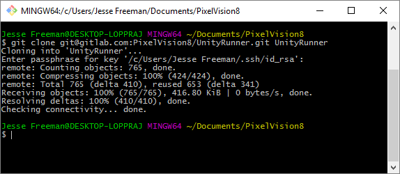
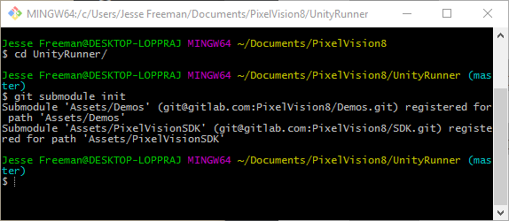
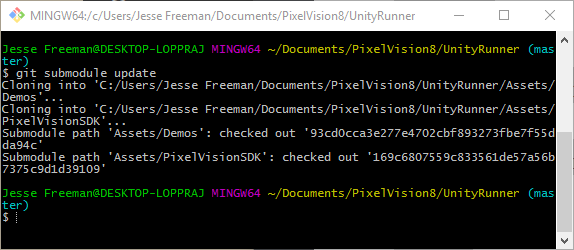

# Setting Up Git Submodules

The [Pixel Vision 8 Runner](https://gitlab.com/PixelVision8/UnityRunner) project contains a [Demo project](https://gitlab.com/PixelVision8/Demos)  with examples of how to use the [Pixel Vision 8 SDK](https://gitlab.com/PixelVision8/SDK) APIs. Each demo highlights a specific aspect of the engine and shows off use cases for drawing sprites, capturing input, working with tilemaps and more. To use this project, you will first need to check out the repo and reconnect the [git submodules](https://git-scm.com/book/en/v2/Git-Tools-Submodules). 

## Checking Out the Project

Let's take a quick moment to see how this works. As an example, we'll clone the Unity Runner project with the following command:

     > git clone git@gitlab.com:PixelVision8/UnityRunner.git UnityRunner

This command will get the project from the repo as and put it into a folder called UnityRunner.

## Initializing Submodules

Next, you will need to go into the new folder you created and type the following:

     > git submodule init

As you can, it will now reconnect the git submodules associated with this project.

## Updating Submodules

Finally, you have to do an update to get all the files from each submodule:

     > git submodule update

Now you should have all the files you need to run this project.

Now you are ready to work on the project. You can go into each submodule and pull changes or updates when new versions or released just like any other git project.

